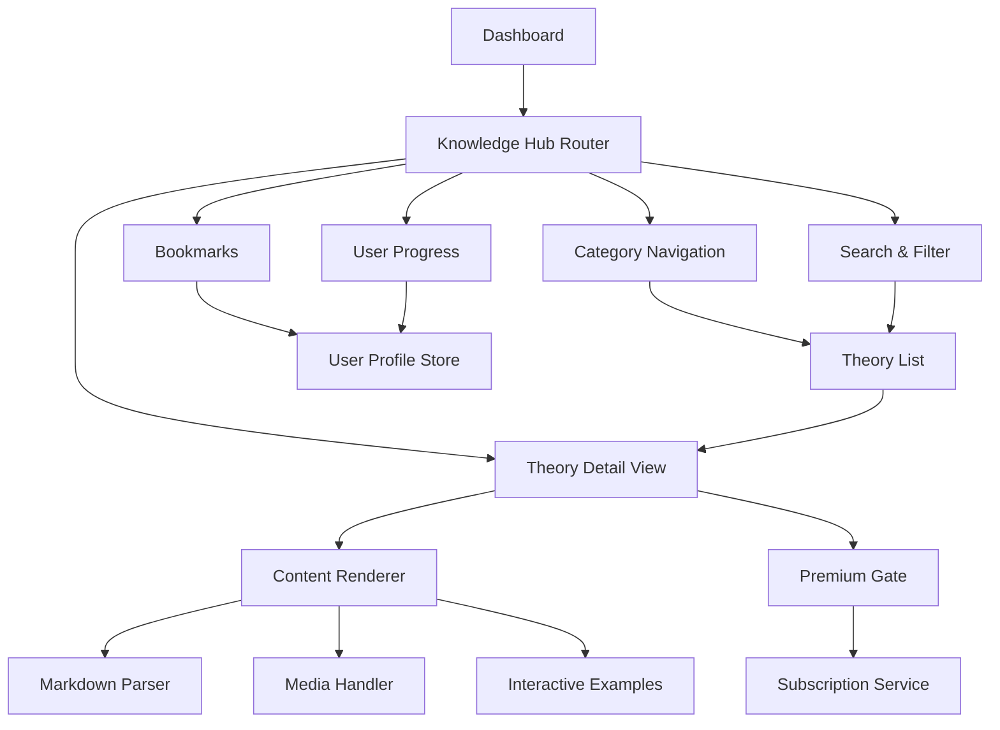

# Knowledge Hub Design Document

## Overview

The Knowledge Hub is a comprehensive learning platform integrated into the Build24 dashboard that provides users with curated psychological theories and persuasion techniques. The design follows Build24's existing dark theme with yellow accents and leverages the current component library for consistency. The hub features a category-based navigation system, search functionality, bookmarking capabilities, and tiered access control for free and premium content.

## Architecture

### High-Level Architecture



### Data Flow

1. **User Navigation**: User accesses Knowledge Hub from dashboard sidebar
2. **Content Loading**: System loads theory metadata and applies user-specific filters
3. **Theory Selection**: User selects theory, system checks access permissions
4. **Content Rendering**: System renders theory content with appropriate media and examples
5. **User Interactions**: Bookmarking, progress tracking, and premium upgrades are handled through user profile updates

## Components and Interfaces

### Core Components

#### 1. KnowledgeHubLayout
- **Purpose**: Main layout wrapper for the Knowledge Hub
- **Props**: `children: ReactNode`
- **Features**: Sidebar navigation, search bar, user progress indicator

#### 2. CategoryNavigation
- **Purpose**: Category-based filtering and navigation
- **Props**: `selectedCategory: string`, `onCategoryChange: (category: string) => void`
- **Categories**: 
  - Cognitive Biases
  - Persuasion Principles
  - Behavioral Economics
  - UX Psychology
  - Emotional Triggers

#### 3. TheoryCard
- **Purpose**: Display theory summary in grid/list view
- **Props**: `theory: Theory`, `isBookmarked: boolean`, `isPremium: boolean`
- **Features**: Title, summary, category badge, bookmark toggle, premium indicator

#### 4. TheoryDetailView
- **Purpose**: Full theory content display
- **Props**: `theory: Theory`, `userAccess: AccessLevel`
- **Sections**: Summary, visual diagram, application guide, related content

#### 5. SearchAndFilter
- **Purpose**: Search functionality and advanced filtering
- **Props**: `onSearch: (query: string) => void`, `filters: FilterState`
- **Features**: Text search, category filters, difficulty level, relevance type

#### 6. BookmarkManager
- **Purpose**: User bookmark management
- **Props**: `userId: string`, `bookmarkedTheories: string[]`
- **Features**: Add/remove bookmarks, bookmark list view, sync with user profile

#### 7. ProgressTracker
- **Purpose**: Gamification and progress tracking
- **Props**: `userId: string`, `userProgress: UserProgress`
- **Features**: Badge display, reading statistics, achievement notifications

#### 8. PremiumGate
- **Purpose**: Access control for premium content
- **Props**: `userTier: 'free' | 'premium'`, `content: ReactNode`
- **Features**: Upgrade prompts, content preview, subscription integration

### Data Models

#### Theory Interface
```typescript
interface Theory {
  id: string;
  title: string;
  category: TheoryCategory;
  summary: string; // 50-80 words
  content: {
    description: string;
    visualDiagram?: string; // URL or embedded content
    applicationGuide: string;
    examples: InteractiveExample[];
    relatedContent: RelatedContent[];
  };
  metadata: {
    difficulty: 'beginner' | 'intermediate' | 'advanced';
    relevance: ('marketing' | 'ux' | 'sales')[];
    readTime: number; // minutes
    tags: string[];
  };
  premiumContent?: {
    extendedCaseStudies: string;
    downloadableResources: DownloadableResource[];
    advancedApplications: string;
  };
  createdAt: Date;
  updatedAt: Date;
}
```

#### UserProgress Interface
```typescript
interface UserProgress {
  userId: string;
  readTheories: string[]; // theory IDs
  bookmarkedTheories: string[];
  badges: Badge[];
  stats: {
    totalReadTime: number;
    theoriesRead: number;
    categoriesExplored: string[];
    lastActiveDate: Date;
  };
  quizResults: QuizResult[];
}
```

#### InteractiveExample Interface
```typescript
interface InteractiveExample {
  id: string;
  type: 'before-after' | 'interactive-demo' | 'case-study';
  title: string;
  description: string;
  beforeImage?: string;
  afterImage?: string;
  interactiveComponent?: string; // Component name for dynamic loading
  caseStudyContent?: string;
}
```

## Data Models

### Content Storage Structure

#### Markdown-based Theory Storage
```
/content/theories/
├── cognitive-biases/
│   ├── anchoring-bias.md
│   ├── scarcity-principle.md
│   └── social-proof.md
├── persuasion-principles/
│   ├── cialdini-reciprocity.md
│   └── fogg-behavior-model.md
└── [other-categories]/
```

#### Theory Metadata Schema
```yaml
---
id: "anchoring-bias"
title: "Anchoring Bias"
category: "cognitive-biases"
difficulty: "beginner"
relevance: ["marketing", "ux"]
readTime: 3
tags: ["pricing", "decision-making", "first-impression"]
isPremium: false
visualDiagram: "/images/theories/anchoring-bias-diagram.svg"
relatedProjects: ["pricing-strategy-build", "landing-page-optimization"]
relatedBlogPosts: ["psychology-of-pricing", "first-impressions-matter"]
---
```

### Database Schema (Firestore)

#### User Progress Collection
```typescript
// Collection: userProgress
// Document ID: userId
{
  readTheories: string[];
  bookmarkedTheories: string[];
  badges: {
    id: string;
    name: string;
    description: string;
    earnedAt: Timestamp;
    category: string;
  }[];
  stats: {
    totalReadTime: number;
    theoriesRead: number;
    categoriesExplored: string[];
    lastActiveDate: Timestamp;
  };
  quizResults: {
    theoryId: string;
    score: number;
    completedAt: Timestamp;
  }[];
}
```

#### Theory Analytics Collection
```typescript
// Collection: theoryAnalytics
// Document ID: theoryId
{
  viewCount: number;
  averageReadTime: number;
  bookmarkCount: number;
  userRatings: {
    userId: string;
    rating: number;
    feedback?: string;
  }[];
  popularityScore: number; // Calculated field
  lastUpdated: Timestamp;
}
```

## Error Handling

### Error Scenarios and Responses

#### 1. Content Loading Failures
- **Scenario**: Theory content fails to load from markdown files
- **Response**: Display skeleton loader with retry button
- **Fallback**: Show cached content if available, otherwise show error message

#### 2. Authentication Errors
- **Scenario**: User session expires while browsing
- **Response**: Redirect to login with return URL to current theory
- **Preservation**: Save current reading progress and bookmarks locally

#### 3. Premium Content Access
- **Scenario**: Free user attempts to access premium content
- **Response**: Show upgrade modal with preview of premium features
- **Graceful Degradation**: Display free content sections while hiding premium sections

#### 4. Search and Filter Failures
- **Scenario**: Search service is unavailable
- **Response**: Fall back to client-side filtering with cached theory metadata
- **User Feedback**: Show warning about limited search functionality

#### 5. Bookmark Sync Failures
- **Scenario**: Bookmark changes fail to sync to user profile
- **Response**: Queue changes locally and retry on next user action
- **User Feedback**: Show sync status indicator in UI

### Error Boundaries

#### TheoryContentErrorBoundary
```typescript
// Wraps theory detail views to handle content rendering errors
// Provides fallback UI with option to report issue
// Logs errors for debugging while maintaining user experience
```

#### SearchErrorBoundary
```typescript
// Handles search and filter component failures
// Falls back to basic category navigation
// Maintains user's current filter state when possible
```

## Testing Strategy

### Unit Testing

#### Component Testing
- **TheoryCard**: Rendering with different theory types, bookmark states, premium indicators
- **SearchAndFilter**: Search functionality, filter combinations, edge cases
- **PremiumGate**: Access control logic, upgrade flow triggers
- **ProgressTracker**: Badge calculations, statistics updates, achievement notifications

#### Service Testing
- **TheoryService**: Content loading, caching, error handling
- **UserProgressService**: Progress tracking, bookmark management, badge awarding
- **AnalyticsService**: View tracking, engagement metrics, popularity calculations

### Integration Testing

#### User Flow Testing
1. **Discovery Flow**: Dashboard → Knowledge Hub → Category → Theory → Bookmark
2. **Search Flow**: Search query → Filter application → Result selection → Content view
3. **Premium Upgrade Flow**: Free content → Premium gate → Upgrade process → Premium access
4. **Progress Tracking Flow**: Theory reading → Progress update → Badge earning → Statistics view

#### API Integration Testing
- **Firebase Auth**: User authentication state management
- **Firestore**: User progress synchronization, analytics data collection
- **Content API**: Theory content loading, media asset delivery

### End-to-End Testing

#### Critical User Journeys
1. **New User Onboarding**: First visit → Category exploration → Theory reading → Bookmark creation
2. **Returning User Experience**: Login → Bookmarks access → Continue reading → Progress review
3. **Premium User Journey**: Premium content access → Resource downloads → Advanced features
4. **Mobile Responsiveness**: Touch interactions, responsive layout, performance on mobile devices

#### Performance Testing
- **Content Loading**: Theory content load times, image optimization, lazy loading
- **Search Performance**: Search response times, filter application speed
- **Database Operations**: User progress updates, bookmark synchronization, analytics collection

### Accessibility Testing

#### WCAG Compliance
- **Keyboard Navigation**: Full keyboard accessibility for all interactive elements
- **Screen Reader Support**: Proper ARIA labels, semantic HTML structure
- **Color Contrast**: Ensure sufficient contrast ratios for text and interactive elements
- **Focus Management**: Clear focus indicators, logical tab order

#### Responsive Design Testing
- **Mobile Devices**: Touch-friendly interactions, readable text sizes
- **Tablet Devices**: Optimal layout for medium screen sizes
- **Desktop**: Full feature accessibility, efficient use of screen space

## Implementation Phases

### Phase 1: Core Infrastructure (Week 1-2)
- Set up routing and basic layout components
- Implement theory content loading system
- Create basic category navigation
- Establish user authentication integration

### Phase 2: Content and Search (Week 2-3)
- Implement search and filtering functionality
- Create theory detail view components
- Add bookmark management system
- Integrate with existing UI component library

### Phase 3: Premium Features and Analytics (Week 3-4)
- Implement premium content gating
- Add progress tracking and gamification
- Create analytics collection system
- Integrate with subscription/payment system

### Phase 4: Polish and Optimization (Week 4)
- Performance optimization and caching
- Mobile responsiveness improvements
- Accessibility enhancements
- User testing and feedback integration
