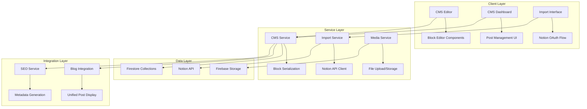

# Design Document

## Overview

The Notion CMS Integration feature will provide users with a rich, block-based content management system that seamlessly integrates with the existing Build24 blog infrastructure. The system will consist of a modern editor interface similar to Notion, a content management dashboard, and robust import capabilities from Notion workspaces. The design leverages the existing Firebase/Firestore backend, Next.js architecture, and shadcn/ui components while introducing new data models and services specifically for user-generated content.

## Architecture

### High-Level Architecture



### Data Flow

1. **Content Creation**: User creates content in block editor → CMS Service serializes blocks → Firestore storage
2. **Content Publishing**: Draft posts → Validation → SEO metadata generation → Public blog integration
3. **Notion Import**: OAuth authentication → Notion API fetch → Block conversion → Firestore storage
4. **Media Handling**: File upload → Firebase Storage → URL generation → Block embedding

## Components and Interfaces

### Core Components

#### 1. Block Editor System

**BlockEditor Component**
```typescript
interface BlockEditorProps {
  initialContent?: Block[];
  onChange: (blocks: Block[]) => void;
  readOnly?: boolean;
}

interface Block {
  id: string;
  type: BlockType;
  content: any;
  properties?: BlockProperties;
  children?: Block[];
}

type BlockType = 'paragraph' | 'heading' | 'image' | 'code' | 'quote' | 'list' | 'divider';
```

**Command Palette**
- Triggered by "/" key
- Fuzzy search for block types
- Keyboard navigation
- Quick insertion of blocks

#### 2. CMS Dashboard

**PostManager Component**
```typescript
interface PostManagerProps {
  posts: CMSPost[];
  onEdit: (postId: string) => void;
  onDelete: (postId: string) => void;
  onPublish: (postId: string) => void;
}

interface CMSPost {
  id: string;
  title: string;
  slug: string;
  status: 'draft' | 'published';
  content: Block[];
  metadata: PostMetadata;
  createdAt: number;
  updatedAt: number;
  authorId: string;
}
```

#### 3. Notion Import System

**NotionImporter Component**
```typescript
interface NotionImporterProps {
  onImportComplete: (posts: CMSPost[]) => void;
  onError: (error: string) => void;
}

interface NotionPage {
  id: string;
  title: string;
  blocks: NotionBlock[];
  properties: Record<string, any>;
}
```

### Service Interfaces

#### 1. CMS Service

```typescript
interface CMSService {
  // Post management
  createPost(authorId: string, title: string): Promise<CMSPost>;
  updatePost(postId: string, updates: Partial<CMSPost>): Promise<void>;
  deletePost(postId: string): Promise<void>;
  publishPost(postId: string): Promise<void>;
  unpublishPost(postId: string): Promise<void>;
  
  // Content operations
  saveContent(postId: string, blocks: Block[]): Promise<void>;
  getPost(postId: string): Promise<CMSPost | null>;
  getUserPosts(authorId: string): Promise<CMSPost[]>;
  
  // Auto-save
  enableAutoSave(postId: string, blocks: Block[]): void;
  disableAutoSave(postId: string): void;
}
```

#### 2. Import Service

```typescript
interface ImportService {
  // Notion integration
  authenticateNotion(userId: string): Promise<string>; // Returns auth URL
  handleNotionCallback(code: string, userId: string): Promise<void>;
  fetchNotionPages(userId: string): Promise<NotionPage[]>;
  importPages(userId: string, pageIds: string[]): Promise<CMSPost[]>;
  
  // Block conversion
  convertNotionBlocks(notionBlocks: NotionBlock[]): Promise<Block[]>;
  downloadNotionMedia(url: string): Promise<string>; // Returns local URL
}
```

#### 3. Media Service

```typescript
interface MediaService {
  uploadFile(file: File, userId: string): Promise<string>; // Returns URL
  deleteFile(url: string): Promise<void>;
  optimizeImage(file: File): Promise<File>;
  generateThumbnail(imageUrl: string): Promise<string>;
}
```

## Data Models

### Firestore Collections

#### 1. CMS Posts Collection (`cms_posts`)

```typescript
interface CMSPostDocument {
  id: string;
  title: string;
  slug: string;
  status: 'draft' | 'published';
  content: Block[]; // Serialized block structure
  metadata: {
    description: string;
    tags: string[];
    category?: string;
    coverImage?: string;
    seoTitle?: string;
    seoDescription?: string;
  };
  authorId: string;
  language: 'en' | 'cn' | 'jp' | 'vn';
  publishedAt?: number;
  createdAt: number;
  updatedAt: number;
  
  // SEO and routing
  customUrl?: string;
  relatedOrigin?: string; // For multi-language support
  
  // Import tracking
  importSource?: 'notion' | 'manual';
  notionPageId?: string;
}
```

#### 2. User Notion Tokens Collection (`user_notion_tokens`)

```typescript
interface NotionTokenDocument {
  userId: string;
  accessToken: string;
  workspaceId: string;
  workspaceName: string;
  connectedAt: number;
  lastSyncAt?: number;
}
```

#### 3. Media Files Collection (`cms_media`)

```typescript
interface MediaDocument {
  id: string;
  userId: string;
  filename: string;
  originalName: string;
  mimeType: string;
  size: number;
  url: string;
  thumbnailUrl?: string;
  uploadedAt: number;
  usedInPosts: string[]; // Array of post IDs
}
```

### Block Structure

```typescript
interface Block {
  id: string;
  type: BlockType;
  content: BlockContent;
  properties?: BlockProperties;
  children?: Block[];
}

interface BlockContent {
  // Text blocks
  text?: RichText[];
  // Image blocks
  url?: string;
  caption?: string;
  altText?: string;
  // Code blocks
  language?: string;
  code?: string;
  // List blocks
  items?: string[];
}

interface RichText {
  text: string;
  bold?: boolean;
  italic?: boolean;
  underline?: boolean;
  strikethrough?: boolean;
  code?: boolean;
  color?: string;
  link?: string;
}
```

## Error Handling

### Error Types

```typescript
enum CMSErrorType {
  VALIDATION_ERROR = 'validation_error',
  PERMISSION_ERROR = 'permission_error',
  NOTION_API_ERROR = 'notion_api_error',
  STORAGE_ERROR = 'storage_error',
  NETWORK_ERROR = 'network_error'
}

interface CMSError {
  type: CMSErrorType;
  message: string;
  details?: any;
  timestamp: number;
}
```

### Error Handling Strategy

1. **Client-Side Validation**: Real-time validation with user feedback
2. **Graceful Degradation**: Offline support with local storage fallback
3. **Retry Logic**: Automatic retry for network failures
4. **User Notifications**: Toast notifications for errors and success states
5. **Error Boundaries**: React error boundaries for component-level error handling

### Error Recovery

- **Auto-save Recovery**: Restore unsaved content from local storage
- **Import Failure Recovery**: Partial import success with detailed error reporting
- **Media Upload Retry**: Automatic retry with progress indication
- **Notion API Rate Limiting**: Exponential backoff and queue management

## Testing Strategy

### Unit Testing

1. **Block Editor Components**
   - Block rendering and editing
   - Command palette functionality
   - Keyboard shortcuts and navigation
   - Content serialization/deserialization

2. **Service Layer**
   - CMS service CRUD operations
   - Import service block conversion
   - Media service file handling
   - Error handling and edge cases

3. **Data Models**
   - Firestore document validation
   - Block structure validation
   - SEO metadata generation

### Integration Testing

1. **End-to-End Workflows**
   - Complete post creation and publishing flow
   - Notion import process
   - Media upload and embedding
   - Multi-language post management

2. **API Integration**
   - Notion API authentication and data fetching
   - Firebase Storage operations
   - Firestore real-time updates

3. **Cross-Browser Testing**
   - Editor functionality across browsers
   - File upload compatibility
   - Responsive design validation

### Performance Testing

1. **Editor Performance**
   - Large document handling
   - Real-time collaboration simulation
   - Memory usage optimization

2. **Import Performance**
   - Large Notion workspace imports
   - Concurrent import operations
   - Media download optimization

3. **Database Performance**
   - Query optimization for post listings
   - Pagination performance
   - Search functionality

### Accessibility Testing

1. **Keyboard Navigation**
   - Full editor keyboard accessibility
   - Screen reader compatibility
   - Focus management

2. **ARIA Implementation**
   - Proper semantic markup
   - Dynamic content announcements
   - Form validation feedback

3. **Visual Accessibility**
   - Color contrast compliance
   - Text scaling support
   - High contrast mode compatibility

## Security Considerations

### Authentication & Authorization

1. **User Authentication**: Leverage existing Firebase Auth system
2. **Post Ownership**: Strict user-post relationship validation
3. **Notion Token Security**: Encrypted storage of OAuth tokens
4. **API Rate Limiting**: Prevent abuse of import functionality

### Content Security

1. **Input Sanitization**: XSS prevention in rich text content
2. **File Upload Validation**: MIME type and size restrictions
3. **Content Moderation**: Basic profanity and spam detection
4. **Media Security**: Secure file storage with access controls

### Data Privacy

1. **GDPR Compliance**: User data export and deletion capabilities
2. **Notion Data Handling**: Minimal data retention from Notion API
3. **User Consent**: Clear permissions for Notion workspace access
4. **Data Encryption**: Sensitive data encryption at rest and in transit
