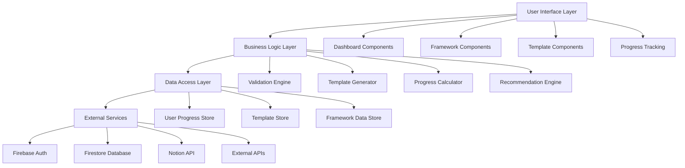

# Design Document: Product Launch Essentials

## Overview

The Product Launch Essentials feature will be integrated into the Build24 platform as a comprehensive guide and toolkit for product owners starting new projects. This feature will provide structured frameworks, templates, and interactive tools to help users navigate the complex process of launching a successful product from conception to market.

The design leverages Build24's existing Next.js architecture, Firebase authentication, and Notion integration to create a seamless experience that aligns with the platform's mission of rapid development and transparent documentation.

## Architecture

### High-Level Architecture



### Integration with Existing Architecture

The feature will extend the current Build24 architecture by:

- Adding new routes under `/app/launch-essentials/`
- Utilizing existing authentication context from `AuthContext`
- Extending Firestore collections for user progress tracking
- Leveraging existing UI components from shadcn/ui
- Following established patterns for component organization

## Components and Interfaces

### Core Components

#### 1. LaunchEssentialsDashboard
```typescript
interface LaunchEssentialsDashboard {
  userId: string;
  currentPhase: LaunchPhase;
  completedSteps: string[];
  overallProgress: number;
  activeProject?: ProjectData;
}
```

#### 2. FrameworkProvider
```typescript
interface FrameworkProvider {
  getFramework(type: FrameworkType): Framework;
  getTemplate(templateId: string): Template;
  validateInput(data: any, schema: ValidationSchema): ValidationResult;
}
```

#### 3. ProgressTracker
```typescript
interface ProgressTracker {
  updateProgress(userId: string, stepId: string, data: any): Promise<void>;
  getProgress(userId: string): Promise<UserProgress>;
  calculateCompletionPercentage(progress: UserProgress): number;
}
```

#### 4. RecommendationEngine
```typescript
interface RecommendationEngine {
  getNextSteps(currentProgress: UserProgress): Recommendation[];
  suggestResources(context: ProjectContext): Resource[];
  identifyRisks(projectData: ProjectData): Risk[];
}
```

### UI Component Structure

```
components/
├── launch-essentials/
│   ├── dashboard/
│   │   ├── OverviewCard.tsx
│   │   ├── PhaseProgress.tsx
│   │   └── NextStepsPanel.tsx
│   ├── frameworks/
│   │   ├── ValidationFramework.tsx
│   │   ├── ProductDefinition.tsx
│   │   ├── TechnicalArchitecture.tsx
│   │   ├── GoToMarketStrategy.tsx
│   │   ├── OperationalReadiness.tsx
│   │   ├── FinancialPlanning.tsx
│   │   ├── RiskManagement.tsx
│   │   └── PostLaunchOptimization.tsx
│   ├── templates/
│   │   ├── TemplateSelector.tsx
│   │   ├── TemplateEditor.tsx
│   │   └── TemplateExporter.tsx
│   └── shared/
│       ├── ProgressIndicator.tsx
│       ├── StepNavigation.tsx
│       └── SaveProgress.tsx
```

## Data Models

### User Progress Model
```typescript
interface UserProgress {
  userId: string;
  projectId: string;
  currentPhase: LaunchPhase;
  phases: {
    [key in LaunchPhase]: PhaseProgress;
  };
  createdAt: Date;
  updatedAt: Date;
  completedAt?: Date;
}

interface PhaseProgress {
  phase: LaunchPhase;
  steps: StepProgress[];
  completionPercentage: number;
  startedAt: Date;
  completedAt?: Date;
}

interface StepProgress {
  stepId: string;
  status: 'not_started' | 'in_progress' | 'completed' | 'skipped';
  data: any;
  completedAt?: Date;
  notes?: string;
}
```

### Framework Model
```typescript
interface Framework {
  id: string;
  name: string;
  description: string;
  phase: LaunchPhase;
  steps: FrameworkStep[];
  templates: Template[];
  resources: Resource[];
}

interface FrameworkStep {
  id: string;
  title: string;
  description: string;
  type: 'input' | 'selection' | 'analysis' | 'template';
  required: boolean;
  validationSchema?: ValidationSchema;
  helpText?: string;
  examples?: string[];
}
```

### Project Data Model
```typescript
interface ProjectData {
  id: string;
  userId: string;
  name: string;
  description: string;
  industry: string;
  targetMarket: string;
  stage: ProjectStage;
  data: {
    validation?: ValidationData;
    definition?: ProductDefinitionData;
    technical?: TechnicalData;
    marketing?: MarketingData;
    operations?: OperationsData;
    financial?: FinancialData;
    risks?: RiskData;
    optimization?: OptimizationData;
  };
  createdAt: Date;
  updatedAt: Date;
}
```

## Error Handling

### Error Types and Handling Strategy

#### 1. Validation Errors
```typescript
class ValidationError extends Error {
  constructor(
    public field: string,
    public message: string,
    public code: string
  ) {
    super(message);
  }
}
```

#### 2. Data Persistence Errors
```typescript
class PersistenceError extends Error {
  constructor(
    public operation: string,
    public originalError: Error
  ) {
    super(`Failed to ${operation}: ${originalError.message}`);
  }
}
```

#### 3. Framework Loading Errors
```typescript
class FrameworkError extends Error {
  constructor(
    public frameworkId: string,
    public message: string
  ) {
    super(`Framework ${frameworkId}: ${message}`);
  }
}
```

### Error Handling Patterns

- **Graceful Degradation**: If a framework fails to load, show a simplified version
- **Auto-Save**: Automatically save progress to prevent data loss
- **Retry Logic**: Implement exponential backoff for network operations
- **User Feedback**: Clear error messages with actionable next steps

## Testing Strategy

### Unit Testing
- **Framework Logic**: Test validation rules, calculations, and recommendations
- **Data Models**: Test serialization, validation, and transformations
- **Utility Functions**: Test helper functions and data processing

### Integration Testing
- **Firebase Integration**: Test authentication and data persistence
- **Component Integration**: Test component interactions and data flow
- **API Integration**: Test external service integrations

### End-to-End Testing
- **User Workflows**: Test complete user journeys through each framework
- **Cross-Browser**: Ensure compatibility across different browsers
- **Mobile Responsiveness**: Test on various device sizes

### Testing Tools and Frameworks
- **Jest**: Unit and integration testing
- **React Testing Library**: Component testing
- **Cypress**: End-to-end testing
- **Firebase Emulator**: Local testing environment

### Package Management
- **Yarn**: Primary package manager for dependency management and script execution
- All development commands should use `yarn` instead of `npm`

## Implementation Phases

### Phase 1: Core Infrastructure
- Set up data models and Firebase collections
- Implement basic progress tracking
- Create foundation UI components

### Phase 2: Framework Implementation
- Implement validation framework
- Add product definition framework
- Create template system

### Phase 3: Advanced Features
- Add remaining frameworks (technical, marketing, etc.)
- Implement recommendation engine
- Add export and sharing capabilities

### Phase 4: Optimization and Polish
- Performance optimization
- Advanced analytics
- User experience enhancements

## Security Considerations

### Data Protection
- **User Data Encryption**: Encrypt sensitive project data at rest
- **Access Control**: Implement proper Firebase security rules
- **Input Validation**: Sanitize all user inputs to prevent XSS attacks

### Authentication and Authorization
- **Role-Based Access**: Different access levels for different user types
- **Session Management**: Secure session handling with Firebase Auth
- **API Security**: Secure API endpoints with proper authentication

### Privacy Compliance
- **Data Minimization**: Only collect necessary data
- **User Consent**: Clear consent mechanisms for data collection
- **Data Portability**: Allow users to export their data

## Performance Considerations

### Optimization Strategies
- **Lazy Loading**: Load frameworks and templates on demand
- **Caching**: Cache frequently accessed templates and frameworks
- **Code Splitting**: Split code by framework to reduce initial bundle size
- **Progressive Enhancement**: Core functionality works without JavaScript

### Monitoring and Analytics
- **Performance Metrics**: Track page load times and user interactions
- **Error Tracking**: Monitor and alert on application errors
- **Usage Analytics**: Track framework usage and completion rates

## Accessibility

### WCAG 2.1 Compliance
- **Keyboard Navigation**: Full keyboard accessibility
- **Screen Reader Support**: Proper ARIA labels and semantic HTML
- **Color Contrast**: Meet AA contrast requirements
- **Focus Management**: Clear focus indicators and logical tab order

### Inclusive Design
- **Multiple Input Methods**: Support various ways to interact with frameworks
- **Clear Language**: Use plain language and avoid jargon
- **Flexible Layouts**: Responsive design that works on all devices
