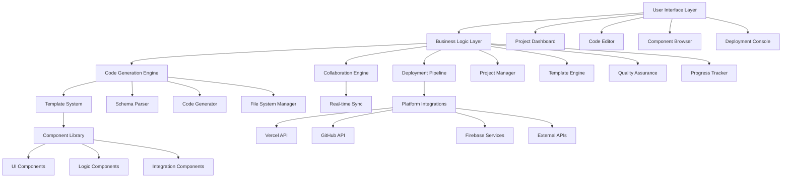

# Design Document: Rapid MVP Builder

## Overview

The Rapid MVP Builder feature extends Build24's platform to provide developers with a comprehensive toolkit for rapidly creating functional minimum viable products. This feature bridges the gap between product planning (from the Launch Essentials framework) and actual implementation, enabling developers to transform validated ideas into working applications within 24-hour development sprints.

The design leverages Build24's existing Next.js architecture, Firebase integration, and component library while introducing new capabilities for code generation, project scaffolding, and automated deployment. The feature emphasizes developer experience, code quality, and rapid iteration while maintaining the platform's commitment to transparency and documentation.

## Architecture

### High-Level Architecture



### Integration with Existing Architecture

The feature will extend the current Build24 architecture by:

- Adding new routes under `/app/mvp-builder/`
- Utilizing existing authentication and user management from `AuthContext`
- Extending Firestore collections for project data and collaboration
- Leveraging existing UI components and design system
- Integrating with the Launch Essentials framework for data continuity
- Following established patterns for component organization and state management

## Components and Interfaces

### Core Components

#### 1. ProjectScaffolder
```typescript
interface ProjectScaffolder {
  createProject(config: ProjectConfig): Promise<ProjectStructure>;
  generateBoilerplate(template: ProjectTemplate): Promise<FileStructure>;
  configureEnvironment(stack: TechStack): Promise<EnvironmentConfig>;
  setupDependencies(dependencies: Dependency[]): Promise<PackageConfig>;
}

interface ProjectConfig {
  name: string;
  template: ProjectTemplate;
  techStack: TechStack;
  features: FeatureSet[];
  integrations: Integration[];
  launchEssentialsData?: LaunchEssentialsData;
}
```

#### 2. ComponentLibrary
```typescript
interface ComponentLibrary {
  getComponents(category?: ComponentCategory): Component[];
  getComponent(id: string): Component;
  customizeComponent(id: string, config: ComponentConfig): CustomComponent;
  generateComponentCode(component: Component): GeneratedCode;
}

interface Component {
  id: string;
  name: string;
  category: ComponentCategory;
  description: string;
  props: PropDefinition[];
  variants: ComponentVariant[];
  dependencies: string[];
  codeTemplate: string;
  previewUrl: string;
}
```

#### 3. CodeGenerator
```typescript
interface CodeGenerator {
  generateFromSchema(schema: DataSchema): GeneratedFiles;
  generateCRUDOperations(model: DataModel): CRUDFiles;
  generateAPIEndpoints(endpoints: APIDefinition[]): APIFiles;
  generateUIComponents(models: DataModel[]): UIFiles;
  updateGeneratedCode(changes: SchemaChanges): UpdateResult;
}

interface GeneratedFiles {
  models: FileContent[];
  services: FileContent[];
  components: FileContent[];
  tests: FileContent[];
  migrations: FileContent[];
}
```

#### 4. CollaborationEngine
```typescript
interface CollaborationEngine {
  initializeSession(projectId: string): CollaborationSession;
  syncChanges(changes: CodeChange[]): Promise<SyncResult>;
  resolveConflicts(conflicts: Conflict[]): Promise<Resolution>;
  broadcastCursor(position: CursorPosition): void;
  addComment(comment: InlineComment): Promise<void>;
}

interface CollaborationSession {
  sessionId: string;
  participants: Participant[];
  activeFiles: string[];
  cursors: Map<string, CursorPosition>;
  comments: InlineComment[];
}
```

#### 5. DeploymentManager
```typescript
interface DeploymentManager {
  deploy(project: Project, platform: DeploymentPlatform): Promise<DeploymentResult>;
  configureEnvironment(config: EnvironmentConfig): Promise<void>;
  setupCICD(pipeline: PipelineConfig): Promise<void>;
  monitorDeployment(deploymentId: string): Promise<DeploymentStatus>;
  rollback(deploymentId: string): Promise<RollbackResult>;
}

interface DeploymentResult {
  deploymentId: string;
  url: string;
  status: DeploymentStatus;
  logs: string[];
  metrics: DeploymentMetrics;
}
```

### UI Component Structure

```
components/
├── mvp-builder/
│   ├── dashboard/
│   │   ├── ProjectDashboard.tsx
│   │   ├── ProjectCard.tsx
│   │   ├── QuickActions.tsx
│   │   └── RecentProjects.tsx
│   ├── scaffolding/
│   │   ├── TemplateSelector.tsx
│   │   ├── TechStackBuilder.tsx
│   │   ├── FeatureSelector.tsx
│   │   └── ProjectConfigurator.tsx
│   ├── editor/
│   │   ├── CodeEditor.tsx
│   │   ├── FileExplorer.tsx
│   │   ├── PreviewPane.tsx
│   │   └── CollaborationPanel.tsx
│   ├── components/
│   │   ├── ComponentBrowser.tsx
│   │   ├── ComponentPreview.tsx
│   │   ├── ComponentCustomizer.tsx
│   │   └── ComponentGenerator.tsx
│   ├── generation/
│   │   ├── SchemaEditor.tsx
│   │   ├── ModelBuilder.tsx
│   │   ├── APIDesigner.tsx
│   │   └── CodePreview.tsx
│   ├── deployment/
│   │   ├── DeploymentConsole.tsx
│   │   ├── PlatformSelector.tsx
│   │   ├── EnvironmentConfig.tsx
│   │   └── DeploymentStatus.tsx
│   └── shared/
│       ├── ProgressTracker.tsx
│       ├── QualityIndicator.tsx
│       ├── CollaborationStatus.tsx
│       └── DocumentationPanel.tsx
```

## Data Models

### Project Model
```typescript
interface Project {
  id: string;
  userId: string;
  name: string;
  description: string;
  template: ProjectTemplate;
  techStack: TechStack;
  features: FeatureSet[];
  structure: ProjectStructure;
  collaborators: Collaborator[];
  deployments: Deployment[];
  progress: ProjectProgress;
  launchEssentialsId?: string;
  createdAt: Date;
  updatedAt: Date;
}

interface ProjectStructure {
  files: FileNode[];
  dependencies: PackageDependency[];
  configuration: ConfigurationFile[];
  environment: EnvironmentVariable[];
}

interface FileNode {
  path: string;
  type: 'file' | 'directory';
  content?: string;
  generated: boolean;
  lastModified: Date;
  modifiedBy: string;
}
```

### Template Model
```typescript
interface ProjectTemplate {
  id: string;
  name: string;
  description: string;
  category: TemplateCategory;
  techStack: TechStack;
  features: FeatureDefinition[];
  structure: TemplateStructure;
  configuration: TemplateConfig;
  popularity: number;
  tags: string[];
  author: string;
  version: string;
}

interface TemplateStructure {
  directories: string[];
  files: TemplateFile[];
  scripts: BuildScript[];
  dependencies: PackageDependency[];
}

interface TemplateFile {
  path: string;
  template: string;
  variables: TemplateVariable[];
  conditions: TemplateCondition[];
}
```

### Component Model
```typescript
interface ComponentDefinition {
  id: string;
  name: string;
  category: ComponentCategory;
  description: string;
  props: PropDefinition[];
  variants: ComponentVariant[];
  dependencies: string[];
  codeTemplate: string;
  styleTemplate: string;
  testTemplate: string;
  documentation: string;
  examples: ComponentExample[];
}

interface PropDefinition {
  name: string;
  type: PropType;
  required: boolean;
  defaultValue?: any;
  description: string;
  validation?: ValidationRule[];
}
```

### Collaboration Model
```typescript
interface CollaborationData {
  projectId: string;
  sessions: CollaborationSession[];
  changes: ChangeHistory[];
  comments: ProjectComment[];
  reviews: CodeReview[];
}

interface ChangeHistory {
  id: string;
  userId: string;
  timestamp: Date;
  type: ChangeType;
  files: string[];
  description: string;
  diff: string;
}

interface CodeReview {
  id: string;
  reviewerId: string;
  files: string[];
  comments: ReviewComment[];
  status: ReviewStatus;
  createdAt: Date;
  completedAt?: Date;
}
```

## Error Handling

### Error Types and Handling Strategy

#### 1. Scaffolding Errors
```typescript
class ScaffoldingError extends Error {
  constructor(
    public template: string,
    public step: string,
    public originalError: Error
  ) {
    super(`Scaffolding failed at ${step} for template ${template}: ${originalError.message}`);
  }
}
```

#### 2. Code Generation Errors
```typescript
class CodeGenerationError extends Error {
  constructor(
    public schema: string,
    public generator: string,
    public details: string
  ) {
    super(`Code generation failed for ${schema} using ${generator}: ${details}`);
  }
}
```

#### 3. Deployment Errors
```typescript
class DeploymentError extends Error {
  constructor(
    public platform: string,
    public stage: string,
    public logs: string[]
  ) {
    super(`Deployment to ${platform} failed at ${stage}`);
  }
}
```

#### 4. Collaboration Errors
```typescript
class CollaborationError extends Error {
  constructor(
    public operation: string,
    public conflictType: string,
    public affectedFiles: string[]
  ) {
    super(`Collaboration conflict in ${operation}: ${conflictType}`);
  }
}
```

### Error Handling Patterns

- **Graceful Degradation**: If code generation fails, provide manual templates
- **Automatic Recovery**: Retry failed operations with exponential backoff
- **Conflict Resolution**: Provide merge tools for collaboration conflicts
- **Rollback Capability**: Allow reverting to previous working states
- **Detailed Logging**: Comprehensive error tracking for debugging

## Testing Strategy

### Unit Testing
- **Code Generation Logic**: Test template processing and code generation
- **Component Library**: Test component rendering and customization
- **Collaboration Engine**: Test real-time synchronization and conflict resolution
- **Deployment Pipeline**: Test deployment configuration and status tracking

### Integration Testing
- **Template System**: Test end-to-end template processing and project creation
- **External APIs**: Test integrations with GitHub, Vercel, and other platforms
- **Database Operations**: Test project data persistence and retrieval
- **Real-time Features**: Test WebSocket connections and live collaboration

### End-to-End Testing
- **Complete Workflows**: Test full project creation to deployment workflows
- **Multi-user Scenarios**: Test collaborative development sessions
- **Cross-platform Deployment**: Test deployment to multiple platforms
- **Performance Under Load**: Test system behavior with multiple concurrent users

### Testing Tools and Frameworks
- **Jest**: Unit and integration testing
- **React Testing Library**: Component testing
- **Playwright**: End-to-end testing
- **WebSocket Testing**: Real-time feature testing
- **Load Testing**: Performance and scalability testing

## Security Considerations

### Code Security
- **Template Validation**: Sanitize and validate all template code
- **Dependency Scanning**: Check for vulnerabilities in generated dependencies
- **Code Injection Prevention**: Prevent malicious code injection in templates
- **Access Control**: Restrict access to sensitive project data

### Collaboration Security
- **Session Management**: Secure real-time collaboration sessions
- **Permission Management**: Control who can edit, view, or deploy projects
- **Data Encryption**: Encrypt sensitive project data in transit and at rest
- **Audit Logging**: Track all project modifications and access

### Deployment Security
- **Environment Variables**: Secure handling of sensitive configuration
- **API Key Management**: Safe storage and rotation of deployment credentials
- **Network Security**: Secure communication with deployment platforms
- **Compliance**: Ensure deployments meet security standards

## Performance Considerations

### Optimization Strategies
- **Lazy Loading**: Load templates and components on demand
- **Code Splitting**: Split generated code into optimized bundles
- **Caching**: Cache frequently used templates and components
- **Incremental Generation**: Only regenerate changed parts of the codebase
- **Background Processing**: Handle heavy operations asynchronously

### Real-time Performance
- **WebSocket Optimization**: Efficient real-time communication
- **Conflict Resolution**: Fast conflict detection and resolution
- **State Synchronization**: Optimized state sync across collaborators
- **Memory Management**: Efficient handling of large codebases

### Scalability
- **Horizontal Scaling**: Support for multiple concurrent projects
- **Resource Management**: Efficient use of system resources
- **Database Optimization**: Optimized queries for project data
- **CDN Integration**: Fast delivery of templates and components

## Accessibility

### WCAG 2.1 Compliance
- **Keyboard Navigation**: Full keyboard accessibility for all features
- **Screen Reader Support**: Proper ARIA labels for complex interfaces
- **Color Contrast**: High contrast mode for code editors
- **Focus Management**: Clear focus indicators in complex UIs

### Developer Accessibility
- **Code Editor Accessibility**: Screen reader compatible code editing
- **Visual Indicators**: Clear visual feedback for all operations
- **Alternative Interfaces**: Voice commands and alternative input methods
- **Documentation**: Accessible documentation and help systems

## Integration Points

### Launch Essentials Integration
- **Data Import**: Import validated requirements and specifications
- **Progress Continuity**: Seamless transition from planning to building
- **Documentation Sync**: Keep project documentation in sync with planning
- **Metrics Alignment**: Align development metrics with business goals

### External Service Integrations
- **Version Control**: GitHub, GitLab, Bitbucket integration
- **Deployment Platforms**: Vercel, Netlify, AWS, Google Cloud
- **Monitoring Services**: Analytics, error tracking, performance monitoring
- **Communication Tools**: Slack, Discord, Microsoft Teams integration

### Development Tool Integrations
- **IDEs**: VS Code, WebStorm integration
- **Package Managers**: npm, yarn, pnpm support
- **Build Tools**: Webpack, Vite, Rollup configuration
- **Testing Frameworks**: Jest, Vitest, Cypress integration
